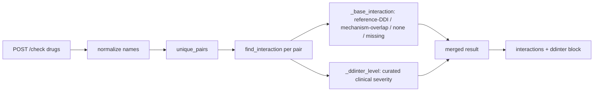
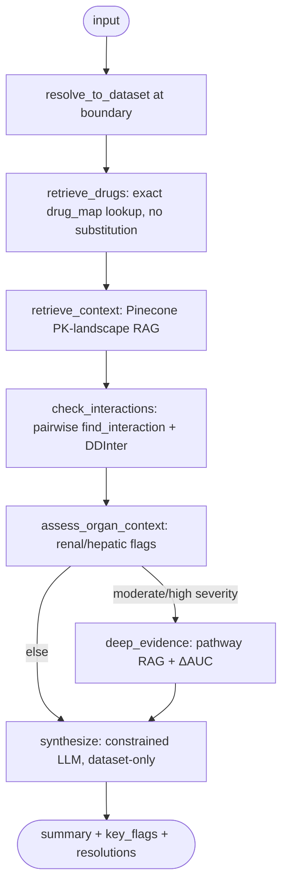
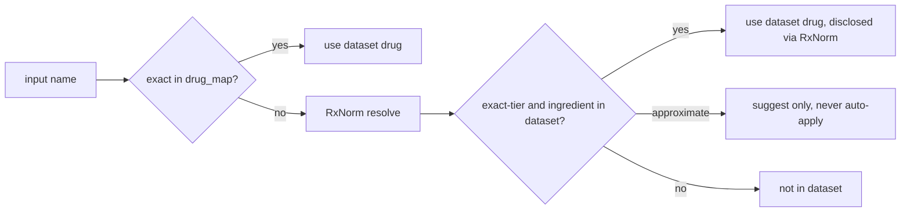

# Architecture

How the pieces fit together. For *why* each choice was made, see
`DESIGN_DECISIONS.md`; for how it's measured, see `EVALUATION.md`.

## Two endpoints, two trust levels

The system is intentionally split into a deterministic path and an agentic path:

| Endpoint | Engine | External deps | Role |
|---|---|---|---|
| `POST /check` | pandas lookup + rules | none (RxNorm only on a miss) | fast, exact interaction screen |
| `POST /analyze` | LangGraph agent + RAG + LLM | OpenAI + Pinecone | narrative synthesis with organ-impairment context |
| `GET /drug/{name}` | dict lookup + RxNorm fallback | RxNorm on a miss | structured drug info; brand/synonym resolution |
| `GET /drugs`, `/health` | in-memory | none | autocomplete, status |

`/check` needs no API keys and is the reproducible core; `/analyze` builds its
agent lazily on first call and returns a clean `503` if keys are absent.

## Data sources

| Source | What it provides | How it's loaded |
|---|---|---|
| **NIH Organ-Impairment CSV** | the source of truth: 271 drugs, enzymes, transporters, fe, ΔAUC, reference inhibitors | `data.py` → `DataStore.drug_map` (committed) |
| **RxNorm / RxNav** (live NIH API) | drug identity: names, brands, synonyms → RxCUI | `rxnorm.py` (cached); dataset anchored via `drug_rxcui.json` |
| **DDInter 2.0** | second interaction source: curated clinical DDIs with severity | `build_ddinter_lookup.py` → `ddinter_pairs.json` → `DataStore.ddinter` (gitignored) |
| **Pinecone** (embeddings of CSV rows) | semantic PK-context retrieval for `/analyze` | `vector_store.py` + `ingest.py` |

## Components

```
src/
  api.py              FastAPI app: endpoints, lazy agent init, identity resolution at the boundary
  models.py           pydantic request/response schemas
  ui.py               Jinja UI mount (/ui)
  services/
    data.py           load_datastore, DataStore (drug_map + ddinter lookup), get_drug, search
    interactions.py   find_interaction (PK evidence + DDInter enrichment), unique_pairs
    identity.py       resolve_to_dataset: exact → RxNorm ingredient → dataset drug
    rxnorm.py         RxNav resolver: exact/approximate/unresolved tiers, brand→ingredient linkage
    agent.py          LangGraph agent (6 nodes) + pure helpers (resolve_drug, organ_impairment_reasons)
    vector_store.py   Pinecone index + OpenAI embeddings
    llm.py            constrained explain() + safety filters
    present.py        attribute glossary / clinician-friendly labels
scripts/
    ingest.py                 embed CSV rows into Pinecone (one-time)
    map_rxcui.py              anchor dataset drugs to RxCUIs
    build_ddinter_lookup.py   derive the DDInter pair lookup
    validate_ddinter.py       external validation cross-check
    eval_explanations.py      grounding / hallucination eval
eval/
    test_cases.yaml, run_tests.py   behavioral harness (71 cases + scorer)
```

## `/check` request flow



## `/analyze` — the LangGraph state graph

Identity is resolved **at the API boundary** (brands/synonyms → dataset drugs)
before the graph runs, so every node operates on dataset drugs.



Node responsibilities:

1. **retrieve_drugs** — exact `drug_map` resolution; unknown names flagged
   `found: false`, never substituted (no Pinecone here — by design).
2. **retrieve_context** — the genuine RAG step: Pinecone search keyed on the
   patient's renal/hepatic state + drug list to surface PK-related drugs.
3. **check_interactions** — deterministic pairwise `find_interaction`
   (reference-DDI → mechanism-overlap → none), now carrying the DDInter block.
4. **assess_organ_context** — renal/hepatic concern flags from `fe`, `renal`,
   enzyme fields (pure helper `organ_impairment_reasons`).
5. **deep_evidence** *(conditional)* — fires only on moderate/high severity;
   second Pinecone query along the shared pathway for related drugs + ΔAUC.
6. **synthesize** — one `gpt-4.1-mini` call (temp 0, JSON mode), strict
   summarizer: dataset facts only, no dosing/verdict, flags `drugs_not_in_dataset`
   and discloses brand→generic `resolutions`.

## Identity resolution chain (`/drug`, `/analyze`)


